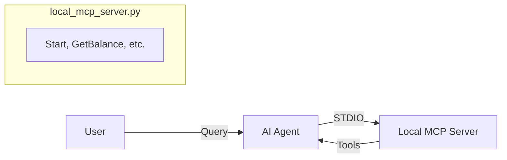
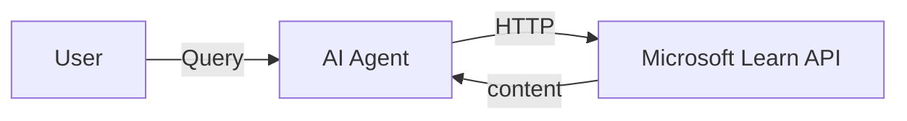

# Azure MCP Framework Examples

This repository demonstrates how to build and use **Model Context Protocol (MCP)** servers and clients using Python and the [Microsoft Agent Framework](https://github.com/microsoft/agent-framework).

It covers two main scenarios:
1.  **Local MCP Server**: Building a custom local server (Banking Demo) and connecting an AI agent to it.
2.  **Hosted MCP Tool**: Connecting an AI agent to a public, hosted MCP endpoint (Microsoft Learn).

## 📂 Project Structure

- **`local_mcp_server.py`**: A custom MCP server built with `FastMCP` that simulates a banking system. It provides tools for checking balances, transaction history, loan calculations, and more.
- **`clientlocalmcp.py`**: An implementation of an AI Agent (using Azure AI Foundry or OpenAI) that connects to the local banking server to answer user queries.
- **`hostedMcptool.py`**: An example of an agent connecting to a remote/hosted MCP tool (specifically the Microsoft Learn documentation API) to answer technical questions.

## ✅ Prerequisites

- Python 3.10 or higher
- [Azure CLI](https://learn.microsoft.com/en-us/cli/azure/install-azure-cli) (for Azure AI Foundry authentication)
- A configured Azure AI Foundry project (optional, if using Azure examples)
- OpenAI API Key (optional, if using OpenAI examples)

## 🛠️ Setup

1.  **Clone the repository** (if you haven't already):
    ```bash
    git clone https://github.com/renzotjpro/AzureMCPFramework.git
    cd AzureMCPFramework
    ```

2.  **Create and activate a virtual environment**:
    ```bash
    python -m venv .venv
    # Windows
    .venv\Scripts\activate
    # Linux/Mac
    source .venv/bin/activate
    ```

3.  **Install dependencies**:
    ```bash
    pip install agent-framework agent-framework-azure-ai azure-identity fastmcp python-dotenv
    ```

4.  **Configure Environment Variables**:
    Create a `.env` file in the root directory. You can use the `env.example` (if provided) or add the following keys:

    ```ini
    # For Azure AI Foundry (Recommended)
    AZURE_AI_PROJECT_ENDPOINT="https://<your-project>.services.ai.azure.com/api/projects/..."
    AZURE_AI_MODEL_DEPLOYMENT_NAME="gpt-4o-mini" # or your deployment name

    # For OpenAI (Alternative)
    OPENAI_API_KEY="sk-..."
    ```

5.  **Authenticate with Azure** (if using Azure AI examples):
    ```bash
    az login
    ```

## 🚀 Usage

### Scenario 1: Local Banking Demo
This demonstrates an agent connecting to a locally running MCP process.

To run the client (which automatically starts the server subprocess):
```bash
python clientlocalmcp.py
```
*The client will demonstrate different examples, including connecting via Azure AI and listing available tools.*

### Scenario 2: Hosted Microsoft Learn Demo
This demonstrates an agent connecting to a remote HTTP-based MCP tool.

To run the hosted tool example:
```bash
python hostedMcptool.py
```
*The agent will attempt to answer questions about Azure by searching Microsoft Learn documentation.*

## 🧩 Architecture

### Local MCP Pattern


### Hosted MCP Pattern


## ⚠️ Common Issues

- **Authentication Error**: Ensure you have run `az login` and that your account has access to the Azure AI project.
- **Server Not Found**: Ensure you are running the scripts from the project root so relative paths to `local_mcp_server.py` resolve correctly.
- **Missing Dependencies**: Double-check that you have installed all required packages listed in the Setup section.
